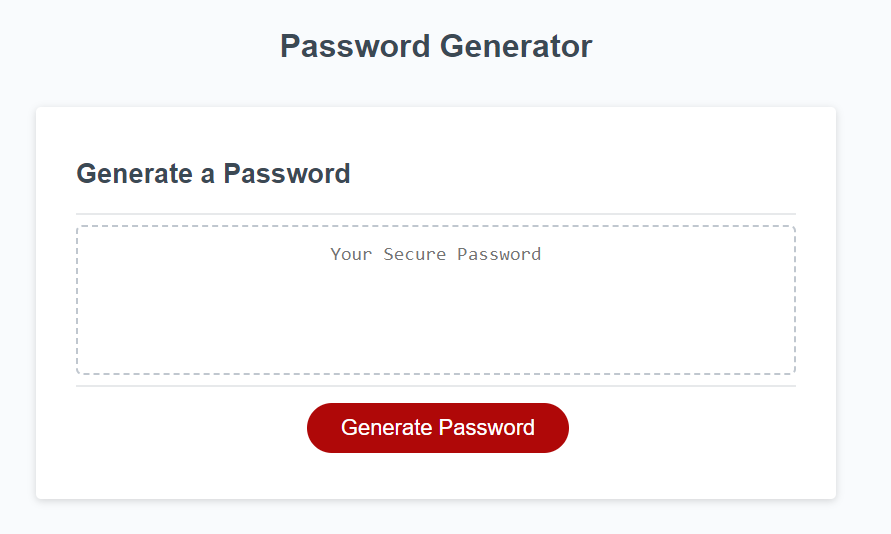

# Password Generator

## Usage

The Password Generator can be accessed at the following link: 

Link to GitHub repo:

The generator is immediatley available upon entering the webpage. It's main functionality comes from the large red button in the center of the page, and the text box above it. 

To begin creating a password, simply click the red button titled "Generate Password". After clicking it, a series of prompts will be triggered, allowing you to choose the length, and which characters you'd like to use. First, enter your desired password length between 8-128 characters, into the resulting text box. Once entered, you will be given four confimations to allow for upper case, lower case, specia characters, and numbers. To approve the character type, simply choose "ok", otherwise, choose "cancel" to exclude that character type from the password criteria. After answering all criteria questions, a password will appear in the dotted border area on the webpage. It can then be copied for use.

In the event that the password length criteria is entered incorrectly, an alert will appear telling you to input a correct numeric value between 8-128, and "error" will appear in the text box. This will also end the function, and the red button will need to be clicked again. In the event that you choose "cancel" on all character confirmation, no password will be generated.

Webpage picture:

## License

MIT License
